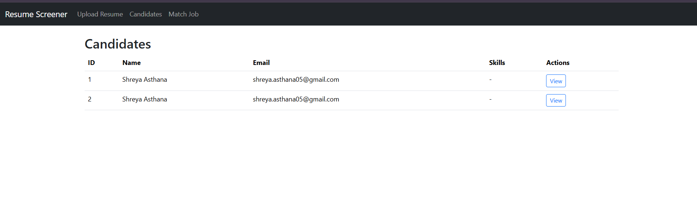

# Smart Resume Screener

**Intelligently parse resumes, extract skills, and match candidates to job descriptions using LLM-based semantic analysis.**

---

## Objective

The Smart Resume Screener automates candidate evaluation by:

* Extracting structured information (skills, experience, education) from resumes.
* Comparing candidates’ skills sections with job descriptions.
* Ranking candidates using an LLM for semantic fit.
* Providing justifications and recommendations for each candidate.

---

## Features

* Upload **PDF or DOCX resumes**.
* Robust **Skills section extraction**, including variations like "Technical Skills," "Skills & Tools," etc.
* Semantic matching with LLM (Groq `llama-3.1-8b-instant`) to generate:

  * Score (1–10)
  * Justification
  * Matches
  * Recommendation
* Dashboard displays **top candidates** sorted by score.
* Simple CSV-based storage; no complex database required.

---

## Tech Stack

* **Backend:** Python, Flask
* **Resume Parsing:** `pdfminer.six`, `python-docx`
* **LLM Integration:** Groq API (`llama-3.1-8b-instant`)
* **Frontend:** HTML, Bootstrap 5
* **Data Storage:** CSV (`resumes.csv`)

---

## Setup Instructions

1. **Clone the repository**

```bash
git clone <your-repo-url>
cd smart-resume-screener
```

2. **Create Python environment**

```bash
python -m venv venv
source venv/bin/activate  # Linux/macOS
venv\Scripts\activate     # Windows
```

3. **Install dependencies**

```bash
pip install -r requirements.txt
```

4. **Set environment variables**


5. **Run the Flask app**

```bash
flask run
```

The app will be available at `http://127.0.0.1:5000/`.

---

## Usage

1. **Upload Resumes**

   * Go to `/upload` in your browser.
   * Upload PDF or DOCX resumes.
   
   

2. **Enter Job Description**
    
   * Go to `/match`.
   * Enter job description text.
   * Click “Match Candidates.”

3. **View Results**

   * Shortlisted candidates appear sorted by score.
   * Matches, recommendation, and justification are clearly displayed.

---

## Architecture

```
          +----------------+
          |  Resume Upload |
          +--------+-------+
                   |
                   v
          +----------------+
          |   Parser.py    | -- Extracts Skills, Experience, Education
          +--------+-------+
                   |
                   v
          +----------------+
          |  CSV Storage   | -- stores parsed resumes
          +--------+-------+
                   |
                   v
          +----------------+
          |  LLM Client    | -- sends Skills + Job Description to Groq API
          +--------+-------+
                   |
                   v
          +----------------+
          |   Flask UI     | -- displays scores, matches, recommendation
          +----------------+
```

---

## LLM Prompts

Example prompt sent to the LLM:

```
You are a technical recruiter. Compare the candidate's Skills section with the Job Description and evaluate fit.

Return ONLY JSON in the following format:
{
  "score": <float>,
  "justification": <string>,
  "matches": [<skills>],
  "recommendation": <string>
}

Job Description:
<job description text>

Candidate Skills Section:
<skills section extracted from resume>
```

* `score`: Candidate fit (1–10)
* `justification`: Reasoning behind the score
* `matches`: Skills that match job requirements
* `recommendation`: Overall recommendation

---

## Future Improvements

* Add **multi-file upload** and batch LLM processing.
* Store parsed resumes in a **database** for large-scale usage.
* Add **resume download & feedback export**.
* Support **more file types** (TXT, RTF).
* Improve **LLM prompt templates** for more accurate recommendations.

